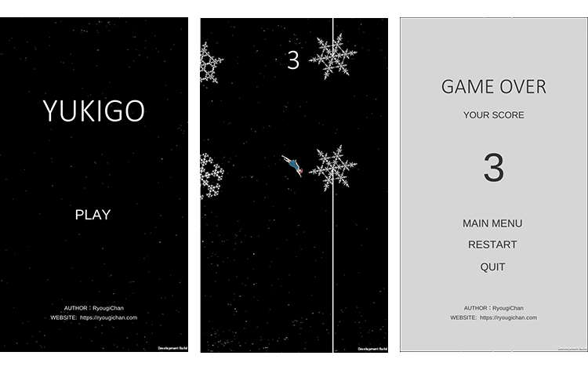

# YukiGO

My first 2D game made by Unity. It's similar to the bonus scene in Android 5 and 6 systems, which trigger by clicking 5 times on the system version number in the setting.

## Tools

- Unity ver2018.2.17
- Microsoft Visual Studio 2017 ver15.8

## Script Language

- C#

## Preview

## Releases

- [Pre-release: YukiGO](https://github.com/RyougiChan/YukiGO/releases)

## Declaration

All resources in this project are based on [CC BY-NC-SA 4.0](https://creativecommons.org/licenses/by-nc-sa/4.0/), that means you can copy and reissue the contents of this project, but you will also have to provide the original author information as well as the agreement statement.

Released under the [Apache License 2.0](LICENSE)

Copyright © [RyougiChan](https://github.com/RyougiChan)